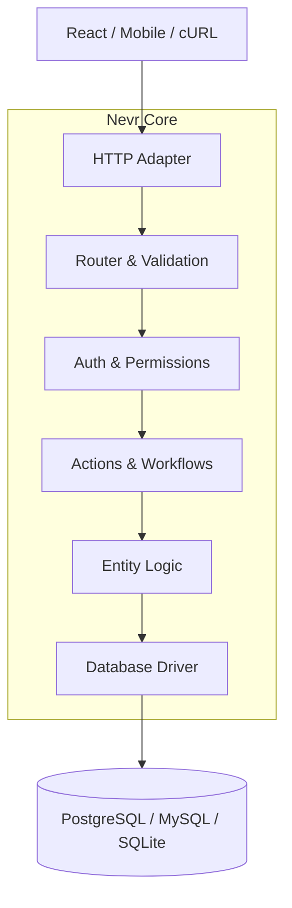

# Introduction

> **Nevr is the Entity-First TypeScript Framework.**

Define your data model once — get a type-safe API, database schema, auth rules, and client SDK automatically.

---

## Why Nevr?

| Traditional Approach | Nevr Approach |
|---------------------|---------------|
| Define Prisma schema | Define Entity once |
| Create DTO classes | Auto-generated from Entity |
| Write controllers | Auto-generated REST API |
| Add validation decorators | Declarative field validation |
| Build auth middleware | Built-in with `.ownedBy()` and `.rules()` |
| Generate OpenAPI manually | Auto-generated from Entity |
| Write TypeScript interfaces | Inferred from Entity |

**Result**: 80% less boilerplate, 100% type-safe.

---

## The Core Philosophy

Most frameworks force you to write code in multiple places:
1.  Database Schema (SQL/Prisma)
2.  API Controllers (validation logic)
3.  TypeScript Interfaces (types)
4.  Authorization Middleware (permissions)

**With Nevr, you define the Entity once.**

```typescript
import { entity, float, string, belongsTo } from "nevr"

const order = entity("order", {
  total: float,
  status: string.default("pending"),
  customer: belongsTo(() => user),
})
  .ownedBy("customer")  // Sets owner field + default rules
  .rules({ 
    create: ["authenticated"],  // Only logged-in users can create
    update: ["owner"],          // Only owner can update
  })
```

### What This Gives You

From this single definition, Nevr gives you everything you need for a production-ready app:

| Generated Output | Description |
|-----------------|-------------|
| **Database Schema** | Prisma schema with proper relations |
| **REST API** | `GET /orders`, `POST /orders`, `PUT /orders/:id`, etc. |
| **Validation** | Type checking + custom validators |
| **Authorization** | Rule-based access control per operation |
| **E2E Type Safety** | End-to-end type safety from backend to frontend |
| **OpenAPI Spec** | Documentation with all endpoints |

---

## Beyond CRUD

Nevr provides the architectural patterns needed for complex, real-world applications.

### 1. Workflow Engine (Sagas) 🔄

**Why?** When business operations span multiple services (inventory, payments, shipping), failures can leave your system in an inconsistent state. The Workflow Engine implements the Saga pattern with automatic compensation (rollback).

```typescript
import { action, step } from "nevr"

// If step 2 (charge) fails, step 1 is automatically compensated (release)
const checkout = action("checkout")
  .workflow([
    step("reserve", inventory.reserve, inventory.release),  // reserve → release on failure
    step("charge", stripe.charge, stripe.refund),           // charge → refund on failure
    step("ship", shipping.createLabel),                      // No compensation needed
  ])
```

| Workflow Method | Description |
|-----------------|-------------|
| `action(name)` | Create a new action builder |
| `step(name, execute, compensate?)` | Define a saga step with optional rollback |
| `.workflow(steps[])` | Chain steps into a saga |
| `.handler(fn)` | Simple action without saga pattern |

### 2. Service Container (DI) 🧩

**Why?** Dependency Injection keeps your code testable and decoupled. Nevr's container is functional (no classes required) with automatic lifecycle management.

```typescript
import { ServiceContainer} from "nevr"

const container = ServiceContainer()

// Register a service with a factory
container.register("payments", () => new StripeService(process.env.STRIPE_KEY))

// Register with lifecycle options
container.register("cache", () => new RedisCache(), { 
  lifecycle: "singleton"  // singleton | transient | scoped
})

// Resolve in handlers
const payments = container.resolve<PaymentService>("payments")
```

| Container Method | Description |
|-----------------|-------------|
| `ServiceContainer()` | Create a new DI container |
| `.register(id, factory, options?)` | Register a service factory |
| `.registerInstance(id, instance)` | Register an existing instance |
| `.resolve<T>(id)` | Synchronously resolve a service |
| `.resolveAsync<T>(id)` | Async resolve (for services needing init) |
| `.has(id)` | Check if service exists |

### 3. Remote Joiner 🌐

**Why?** Modern apps integrate with external services (Stripe, CMS, microservices). Remote Joiner lets you include external data in API responses without N+1 queries.

```typescript
import { entity, belongsTo } from "nevr"

const user = entity("user", {
  email: string.email(),
  // This relation fetches from Stripe, not the database
  subscription: belongsTo(() => stripePlan).remote("stripe"),
})

// API request: GET /api/users?include=subscription
// Nevr fetches user from DB, subscription from Stripe adapter
```

| Remote Joiner Method | Description |
|---------------------|-------------|
| `.remote(adapterName)` | Mark relation as remote (fetched from external service) |


---

## Architecture Overview

Nevr fits into your existing stack. It is **framework-agnostic** at the HTTP layer and **driver-agnostic** at the database layer.



### Supported Adapters

| Layer | Options |
|-------|---------|
| **HTTP** | Express, NextJs, Hono, more coming soon |
| **Database** | Prisma (PostgreSQL, MySQL, SQLite) |
| **Auth** | Auth integration |

---

## Full-Stack TypeScript

Nevr is designed for **end-to-end type safety**. Types flow seamlessly from your entity definitions to your frontend client — no code generation, no runtime overhead, just pure TypeScript inference.

### The $Infer Pattern

Nevr uses a `$Infer` pattern to extract types from your server:

::: code-group

```typescript [src/nevr.config.ts]
import { defineConfig } from "nevr"
import { user, product, order } from "./entities/index.js"
import { auth } from "nevr/plugins/auth"

export const config = defineConfig({
  database: "postgresql",
  entities: [user, product, order],
  plugins: [auth()],
})

export default config
```

```typescript [src/server.ts]
import { nevr } from "nevr"
import { prisma } from "nevr/drivers/prisma"
import { PrismaClient } from "@prisma/client"
import { config } from "./nevr.config.js"

export const api = nevr({ ...config, driver: prisma(new PrismaClient()) })

// Export the server type (no runtime import on client)
export type API = typeof api
```

```typescript [src/client.ts]
import { createClient } from "nevr/client"
import type { API } from "./server"  // Type-only import

// Use curried pattern for full type inference
const client = createClient<API>()({
  baseURL: "http://localhost:3000",
  entities: ["user", "product", "order"],
})

// Full autocomplete and type checking!
const { data } = await client.users.create({
  email: "user@example.com",  // ✅ Required field
  name: "John",               // ✅ Required field
  // unknownField: "oops",    // ❌ Type error
})
```

:::

### Type Inference Utilities

| Type | Description |
|------|-------------|
| `$Infer<T>` | Extract all types from server |
| `InferEntityData<E>` | Get entity data type |
| `InferCreateInput<E>` | Get create input type (no id/timestamps) |
| `InferUpdateInput<E>` | Get update input type (all optional) |
| `InferSessionFromClient<C>` | Get session type from client |
| `ListOptions<T>` | Typed filtering, sorting, pagination |

### Why This Matters

| Traditional Approach | Nevr Approach |
|---------------------|---------------|
| Generate types with codegen | Types inferred at compile time |
| Sync OpenAPI → TypeScript | Single source of truth |
| Runtime validation only | Compile-time + runtime validation |
| Manual type exports | Automatic via `$Infer` |

**Result**: Changes to your entities automatically propagate to your frontend types. No regeneration step, no sync issues.

---

## Core Exports Reference

| Export | Category | Description |
|--------|----------|-------------|
| `entity` | Entity DSL | Create an entity definition |
| `string`, `int`, `float`, `bool`, `datetime`, `json` | Fields | Primitive field types |
| `belongsTo`, `hasMany`, `hasOne` | Relations | Define relationships |
| `action`, `step` | Actions | Create custom operations & workflows |
| `everyone`, `authenticated`, `owner`, `admin` | Rules | Built-in authorization rules |
| `ServiceContainer` | DI | Create service container |
| `NevrErrorClass` | Errors | Base error class |

---

## Next Steps

- [Comparison](/get-started/comparison) - See how Nevr stacks up against NestJS and tRPC
- [Installation](/get-started/installation) - Set up your first project in minutes
- [Basic Usage](/get-started/basic-usage) - Build a complete API
